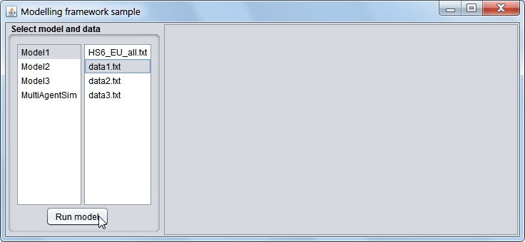
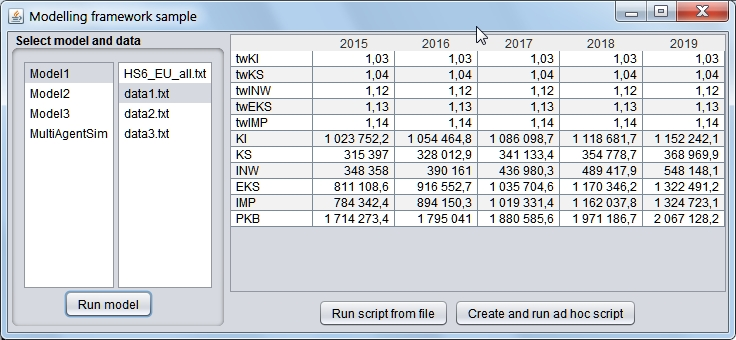
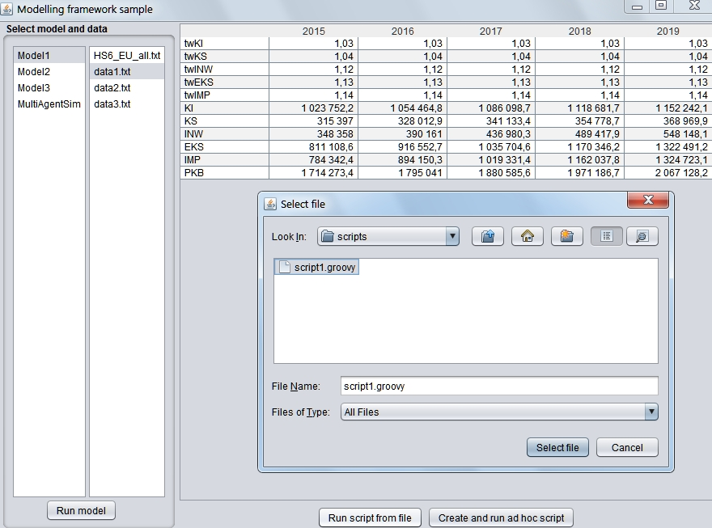
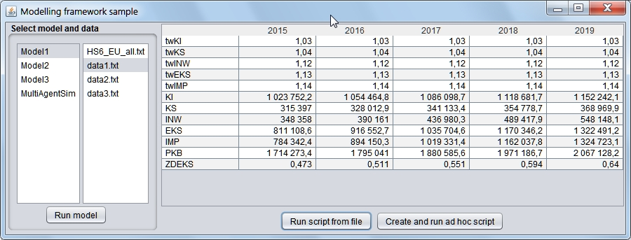
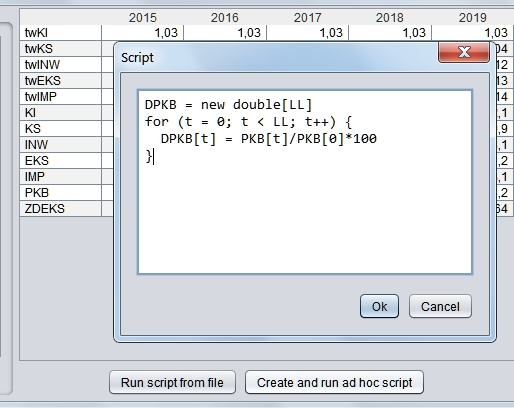
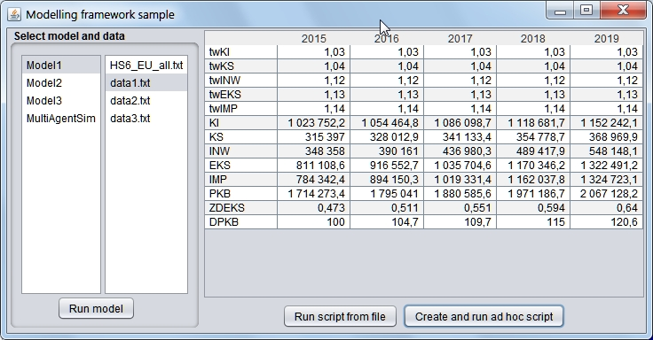

# UTP5_PW_S19058

## Zadanie: środowisko modelowania

Zadanie obejmuje material, dotyczący: refleksji, adnotacji i skryptów.
W pełnej wersji to zadanie stanowi mały projekt.
Dlatego na początku zostaną przedstawione objaśnienia.

Na końcu sformułowane jest samo zadanie do wykonania - [ZOBACZ](#zadanie-do-wykonania).
oraz ważna uwaga nt oprogramowania skryptow - [SKRYPTY POMOC](#skrypty---pomoc)

## 1. Założenia ogólne

W klasach umieszczonych w pakiecie models zdefiniowano modele symulacyjne, wykonujące jakieś obliczenia dla okresów (np. lat)
Definicja modelu zawiera:

* pole o nazwie LL, oznaczające liczbę lat symulacji,
* pola oznaczające zmienne modelu - są to tablice liczb rzeczywistych. 
* ew. pola pomocnicze
* metodę public void run(), wykonująca obliczenia.
* ew. inne metody pomocnicze.

Pola 1 i 2 są oznaczane adnotacją `@Bind`, co umozliwia:
- nadanie wartości zmiennym wejściowym modelu przed wykonaniem obliczeń,
- pobranie wartości zmiennych wyliczonych w modelu (po wykonaniu obliczeń).

Wszystkie zmienne oznaczone adnotacją `@Bind` są dostępne dla skryptów, które mogą być uruchamiane po wykonaniu obliczen modelowych i  wykonywać jakieś dalsze obliczenia.
Są także dostępne dla ew. innych modeli.

Zarządzaniem obliczeniami zajmuje się klasa `Controller`, która ma następujące publiczne składowe:

* konstruktor - `Controller(String modelName)` - parametrem jest tu nazwa klasy modelu,
* `Controller readDataFrom(String fname)` - wczytuje dane do obliczeń z  pliku o nazwie fname.
* `Controller runModel()` - uruchamia obliczenia modelowe,
* `Controller runScriptFromFile(String fname)` - wykonuje skrypt z pliku o nazwie fname,
* `Controller runScript(String script)` - wykonuje kod skryptu podany jako napis,
* `String getResultsAsTsv()` - zwraca wyniki obliczeń (wszystkie zmienne z modelu oraz zmienne utworzone w skryptach) w postaci  napisu, którego kolejne wiersze zawierają nazwę zmiennej i jej wartosci, rozdzielone znakami tabulacji.

## 2.  Założenia co do danych wejściowych

Pliki z danymi wejściowymi zawierają w kolejnych wierszach dane w postaci:

`nazwa_zmiennej wartość1  [ wartość2 ... wartoścN ]`

Specjalny wiersz zaczynający się słowem  `LATA` specyfikuje lata obliczeń, np.
`LATA  2015 2016 2017 2018 2019`

Na podstawie tego wiersza definiowana jest wartość specjalnej zmiennej LL (liczba lat obliczeń), dostepnej w modelu i w skryptach.

Wartości dla zmiennych może być od `1 do LL`.
Jesli jest ich mniej niż `LL`, to pozostałe są ustalane na ostatnią z podanych wartości.

## 3. Przykład

Mamy następujący model:

```java
public class Model1 {
  
  @Bind private int LL; // liczba lat
  
  @Bind private  double[] twKI; // tempo wzrostu kons.ind.
  @Bind private  double[] twKS; // tempo wzrostu kons.społ.
  @Bind private  double[] twINW; // tempo wzrostu inwestycji
  @Bind private  double[] twEKS; // tempo wzrostu eksportu
  @Bind private  double[] twIMP; // tempo wzrostu importu

  
  @Bind private double[] KI;  // kons.ind.
  @Bind private double[] KS;  // kons.społeczna
  @Bind private double[] INW;  // inwestycje.
  @Bind private double[] EKS;  // eksport
  @Bind private double[] IMP;  // import.
  @Bind private double[] PKB;  // PKB
  
  private double temp; // pole nie związane z danymi dla modelu ani jego wynikami
  
  public Model1() {}
  
  public void run() {
    PKB = new double[LL];
    PKB[0] = KI[0] + KS[0] + INW[0] + EKS[0] - IMP[0];
    for (int t=1; t < LL; t++) {
      KI[t] = twKI[t]* KI[t-1];
      KS[t] = twKS[t]* KS[t-1];
      INW[t] = twINW[t]* INW[t-1];
      EKS[t] = twEKS[t]* EKS[t-1];
      IMP[t] = twIMP[t]* IMP[t-1];
      PKB[t] = KI[t] + KS[t] + INW[t] + EKS[t] - IMP[t];
    }
  }
}
```

Dla pliku `data1.txt` o następującej postaci:

```
LATA	2015 2016 2017 2018 2019
twKI	1.03
twKS	1.04
twINW	1.12
twEKS	1.13
twIMP	1.14
KI	1023752.2
KS	315397
INW	348358
EKS	811108.6
IMP	784342.4
```

następujący fragment programu głównego:

```java
    Controller ctl = new Controller("Model1");
    ctl.readDataFrom(dataDir + "data1.txt") 
                    .runModel()
    String res= ctl.getResultsAsTsv();
    System.out.println(res);
```
 
wypisze na konsoli:

```
LATA	2015	2016	2017	2018	2019
twKI	1.03	1.03	1.03	1.03	1.03
twKS	1.04	1.04	1.04	1.04	1.04
twINW	1.12	1.12	1.12	1.12	1.12
twEKS	1.13	1.13	1.13	1.13	1.13
twIMP	1.14	1.14	1.14	1.14	1.14
KI	1023752.2	1054464.766	1086098.70898	1118681.6702494002	1152242.1203568822
KS	315397.0	328012.88	341133.3952	354778.73100800003	368969.88024832006
INW	348358.0	390160.96	436980.2752000001	489417.90822400013	548148.0572108802
EKS	811108.6	916552.7179999999	1035704.5713399998	1170346.1656141996	1322491.1671440455
IMP	784342.4	894150.3359999999	1019331.3830399998	1162037.7766655996	1324723.0653987834
PKB	1714273.4	1795040.9880000001	1880585.5676800003	1971186.6984300003	2067128.1595613444
```

a dla pliku `data2.txt`, wyglądającego tak:

```
LATA	2015 2016 2017 2018 2019
twKI	1.03 1.05 1.07
twKS	1.04
twINW	1.12
twEKS	1.13
twIMP	1.14
KI	1023752.2
KS	315397
INW	348358
EKS	811108.6
IMP	784342.4
```

uzyskamy po

```java
ctl.readDataFrom(dataDir + "data2.txt").runModel()
```

wynik:

```
LATA	2015	2016	2017	2018	2019
twKI	1.03	1.05	1.07	1.07	1.07
twKS	1.04	1.04	1.04	1.04	1.04
twINW	1.12	1.12	1.12	1.12	1.12
twEKS	1.13	1.13	1.13	1.13	1.13
twIMP	1.14	1.14	1.14	1.14	1.14
KI	1023752.2	1074939.81	1150185.5967	1230698.5884690003	1316847.4896618305
KS	315397.0	328012.88	341133.3952	354778.73100800003	368969.88024832006
INW	348358.0	390160.96	436980.2752000001	489417.90822400013	548148.0572108802
EKS	811108.6	916552.7179999999	1035704.5713399998	1170346.1656141996	1322491.1671440455
IMP	784342.4	894150.3359999999	1019331.3830399998	1162037.7766655996	1324723.0653987834
PKB	1714273.4	1815516.032	1944672.4554000003	2083203.6166496002	2231733.528866293
```

## 4. Skrypty

Skrypty najłatwiej będzie pisać w języku Groovy. W skryptach mają być dostępne wszystkie wczytane dane oraz  dane z modelu (ale tylko oznaczone przez @Bind).
Zmienne utworzone w skrypcie mają być dostępne zarówno w wynikowym tsv, jak i w ew. innych modelach (o ile występują tam  jako pola oznaczone przez @Bind), a także innych skryptach. Wyjątkiem od tej reguły są zmienne o jednoliterowych nazwach  pisanych małą literą (np. i, j k, p) - te zmienne nie będą widoczne w wynikach ani dostępne w modelach czy innych skryptach.

Przykładowy skrypt, zapisany w pliku `script1.groovy ` może wyglądać tak (obliczany tu jest wskaźnik tzw. zdolności eksportowej):

```groovy
ZDEKS = new double[LL]
for (i = 0; i < LL; i++) {
  ZDEKS[i] =  EKS[i]/PKB[i];
}
```

Uwaga: w tym skrypcie dostępna jest zmienna `LL`, oznaczająca liczbę lat oraz zmienne powstałe w wyniku obliczen modelowych (PKB i EKS). Skrypt tworzy nowe zmienne ZDEKS oraz i, ale tylko ZDEKS będzie  widoczna w wynikach i dostępna dla innych modeli i skryptów.

Przykładowe wywołanie:

```java
    Controller ctl = new Controller("Model1");
    ctl.readDataFrom(dataDir + "data2.txt") 
                    .runModel()
                    .runScriptFromFile(scriptDir + "script1.groovy");
    String res= ctl.getResultsAsTsv();
    System.out.println(res);
```  

wypisze:

```
LATA	2015	2016	2017	2018	2019
twKI	1.03	1.05	1.07	1.07	1.07
twKS	1.04	1.04	1.04	1.04	1.04
twINW	1.12	1.12	1.12	1.12	1.12
twEKS	1.13	1.13	1.13	1.13	1.13
twIMP	1.14	1.14	1.14	1.14	1.14
KI	1023752.2	1074939.81	1150185.5967	1230698.5884690003	1316847.4896618305
KS	315397.0	328012.88	341133.3952	354778.73100800003	368969.88024832006
INW	348358.0	390160.96	436980.2752000001	489417.90822400013	548148.0572108802
EKS	811108.6	916552.7179999999	1035704.5713399998	1170346.1656141996	1322491.1671440455
IMP	784342.4	894150.3359999999	1019331.3830399998	1162037.7766655996	1324723.0653987834
PKB	1714273.4	1815516.032	1944672.4554000003	2083203.6166496002	2231733.528866293
ZDEKS	0.47315008212808995	0.5048441885640148	0.5325856127925489	0.561801139485567	0.5925847105123984
```

## 5.  GUI

Dodatkowe punkty (ponad ustalone max) można uzyskac za przygotowanie GUI do działania z modelami i skryptami.
Oto ad hoc przygotowany przykład takiego interfejsu.



Po naciśnięciu "Run model":



Uwaga: proszę zwrócić uwagę na formatowanie liczb

Można teraz wybrać skrypt z pliku:



i od razu zobaczyć dodatkowy wynik:



albo wybrać "Create and run ad hoc script" aby wpisać kod skryptu:



i od razu uzyskac wynik:



## 6. Dodatkowe właściwości

Warto pomyśleć nad tym jak uprościc pisanie skryptów. Np. zamiast:

```groovy
DPKB = new double[LL]
for (t = 0; t < LL; t++) {
  DPKB[t] = PKB[t]/PKB[0]*100
}
```

chcielibyśmy pisać tak:

```groovy
DPKB = PKB/PKB[0]
```

To nie jest trudne. Procentuje dodatkowymi punktami ponad max.

I wreszcie ....

# Zadanie do wykonania

Mając wygenerowany projekt z klasą `Main` oraz `models.Model1`, a także plik z danymi wejściowymi `data1.txt`:

```
LATA	2015 2016 2017 2018 2019
twKI	1.03
twKS	1.04
twINW	1.12
twEKS	1.13
twIMP	1.14
KI	1023752.2
KS	315397
INW	348358
EKS	811108.6
IMP	784342.4
```

oraz plik skryptu `script1.groovy`:

```groovy
ZDEKS = new double[LL]
for (i = 0; i < LL; i++) {
  ZDEKS[i] =  EKS[i]/PKB[i];
}
```

zdefinować adnotację `@Bind` oraz klasę `Controller` w taki sposób, aby poniższy program:

```java
public class Main {

  public static void main(String[] args) {
    String dataDir = System.getProperty("user.home") + "/Modeling/data/";
    String scriptDir = System.getProperty("user.home") + "/Modeling/scripts/";
    Controller ctl = new Controller("Model1");
    ctl.readDataFrom(dataDir + "data2.txt") 
                    .runModel()
                    .runScriptFromFile(scriptDir + "script1.groovy");
    String res= ctl.getResultsAsTsv();
    System.out.println(res);
  }
}
```

wyprowadził na konsolę:

```
LATA	2015	2016	2017	2018	2019
twKI	1.03	1.05	1.07	1.07	1.07
twKS	1.04	1.04	1.04	1.04	1.04
twINW	1.12	1.12	1.12	1.12	1.12
twEKS	1.13	1.13	1.13	1.13	1.13
twIMP	1.14	1.14	1.14	1.14	1.14
KI	1023752.2	1074939.81	1150185.5967	1230698.5884690003	1316847.4896618305
KS	315397.0	328012.88	341133.3952	354778.73100800003	368969.88024832006
INW	348358.0	390160.96	436980.2752000001	489417.90822400013	548148.0572108802
EKS	811108.6	916552.7179999999	1035704.5713399998	1170346.1656141996	1322491.1671440455
IMP	784342.4	894150.3359999999	1019331.3830399998	1162037.7766655996	1324723.0653987834
PKB	1714273.4	1815516.032	1944672.4554000003	2083203.6166496002	2231733.528866293
ZDEKS	0.47315008212808995	0.5048441885640148	0.5325856127925489	0.561801139485567	0.5925847105123984
```

Specyfikacje użytych metod klasy `Controller` podano w p. 1 objaśnień.

Plików `Main.java` oraz `Model1.java` nie wolno modyfikować. Umiejscowienie plików `data1.txt` i `script1.groovy` jest okreslone przez metodę main klasy `Main`.
Przygotować program tak, aby działał dla innych modeli i danych oraz innych skryptów. Aby to przetestowac można stworzyć dodatkowe klasy w pakiecie.

Dodatkowe punkty ponad max uzyskujemy za:
przygotowanie GUI (zob. p. 5 objaśnień)
ułatwienia w pisaniu skryptów  (zob. p. 6 objaśnień)

# Skrypty - pomoc

Skrypty piszemy w języku Groovy bo pisać mozna tak samo jak w Javie, a dodatkowo jest b. dużo ułatwień.

Aby mógł  być odnaleziony Script Engine groovy'ego na ścieżce CLASSPATH (w Eclipse - Buildpath) musi być umieszczony `groovy-all -x.x.x.jar`
np. `groovy-all-2.4.5.jar`  (można go wziąć z katalogu `P:\FTP(Public)\kb\UTP\Cwiczenia)`..

JAR nalezy umieścić w zewnętrznym wobec projektu  katalogu (np. C\'ExtLib) i podać go pod "External JAR files" w Buildpath Configure.
Nie przysylamy JARow z projektem!


